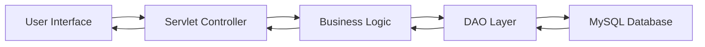

# 🛒 GadgetHub – E-Commerce Web Application

<p align="center">
  
  
  
  
  
</p>

<p align="center">
  <b>A full-stack E-Commerce web application to browse, manage, and purchase gadgets efficiently</b>
</p>

---

## 📌 Overview

GadgetHub is a dynamic **E-Commerce Web Application** built using **Java (JSP & Servlets)**.  
It allows users to explore gadgets, manage carts, and place orders, while also providing an admin interface for managing products.

This project demonstrates strong fundamentals in **full-stack development**, **database integration**, and **MVC architecture**.

---

## ✨ Features

- 🔐 User Authentication (Login/Register)  
- 🛍️ Product Listing & Categories  
- 🔎 Search Products  
- 🛒 Add to Cart & Manage Cart  
- 📦 Order Placement  
- 📜 Order History  
- 🛠️ Admin Dashboard  
- 💾 MySQL Database Integration  

---

## 🧠 Architecture


---

## 🏗️ Tech Stack

 ### Frontend:
 - HTML5
 - CSS3
 - JavaScript
 - BootStrap
### Backend :
 - Java (Core Java)
 - JSP
 - Servlet
 - JDBC

 ### DataBase:
  - MySQL

 ### Tools:
  - Apache Tomat
  - Git and GitHub
  - Eclipse / Intellij Idea

---

## 📂 Project Structure

```
GadgetHub/
│── src/
│   ├── servlets/
│   ├── dao/
│   ├── model/
│
│── WebContent/
│   ├── css/
│   ├── js/
│   ├── images/
│   ├── jsp/
│
│── WEB-INF/
│   ├── web.xml
│
│── database/
│   ├── gadgethub.sql
 ```
## 📊 Use Cases
- 🛒 Online Gadget Shopping
- 🧑‍💻 Learning Full Stack Java Development
- 📦 Inventory Management System
- 🏪 Mini E-Commerce Platform

## 🚀 Future Improvements
- 💳 Payment Gateway Integration (Razorpay/Stripe)
- 📱 Fully Responsive UI
- ⭐ Product Reviews & Ratings
- 🤖 AI-based Recommendations

## 👨‍💻 Author
 Rayees Ali
B.Tech CSE | Full Stack Developer


